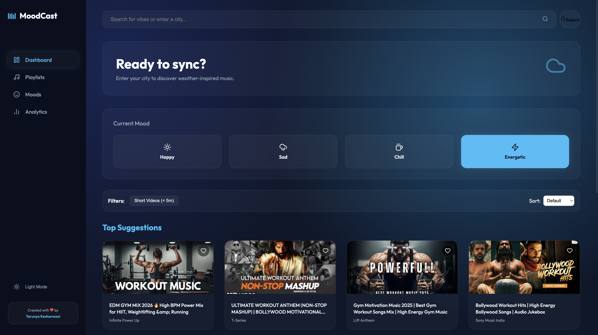

# 🌊 MoodCast

**Author:** Tarunya Kesharwani  
**Live Demo:** [tarunya-moodcast.vercel.app](https://tarunya-moodcast.vercel.app/)

MoodCast is a premium, **dark-mode-first** music discovery platform that uses a proprietary "Synergy Engine" to curate the perfect playlist based on your **current weather** and **internal mood**.



## ✨ Key Features

-   🧠 **Synergy Engine**: Advanced logic that merges atmospheric data with emotional states.
-   🌥️ **Weather Discovery**: Real-time fetching from OpenWeatherMap.
-   🎶 **YouTube Integration**: Search and play millions of tracks instantly.
-   🌗 **Dual Themes**: A true "High-Contrast Light Mode" and a "Premium Dark Mode".
-   🎨 **Glassmorphism UI**: Stunning, modern design with Lucide Icons and CSS animations.
-   📂 **Persistent Favorites**: Save your target tracks for later, powered by LocalStorage.

## 🛠️ Built With

-   **React** (Functional Components & Hooks)
-   **CSS3** (Custom Properties & Keyframe Animations)
-   **Lucide React** (Professional Iconography)
-   **YouTube API v3**
-   **OpenWeatherMap API**

## 🚀 Getting Started

1.  **Clone the Repo**:
    ```bash
    git clone https://github.com/TarunyaProgrammer/MoodCast-WeatherNSongs.git
    cd MoodCast
    ```

2.  **Install Dependencies**:
    ```bash
    npm install
    ```

3.  **Environment Variables**:
    Create a `.env` file in the root:
    ```env
    VITE_OPENWEATHER_API_KEY=your_key_here
    VITE_YOUTUBE_API_KEY=your_key_here
    ```

4.  **Launch the App**:
    ```bash
    npm run dev
    ```

## 📜 License

This project is licensed under the **Creative Commons Attribution-NonCommercial 4.0 International (CC BY-NC 4.0)**.
- **Attribution**: You must give appropriate credit to **Tarunya Kesharwani**.
- **Non-Commercial**: You may not use this material for commercial purposes.

---
© 2026 Tarunya Kesharwani. All Rights Reserved.
